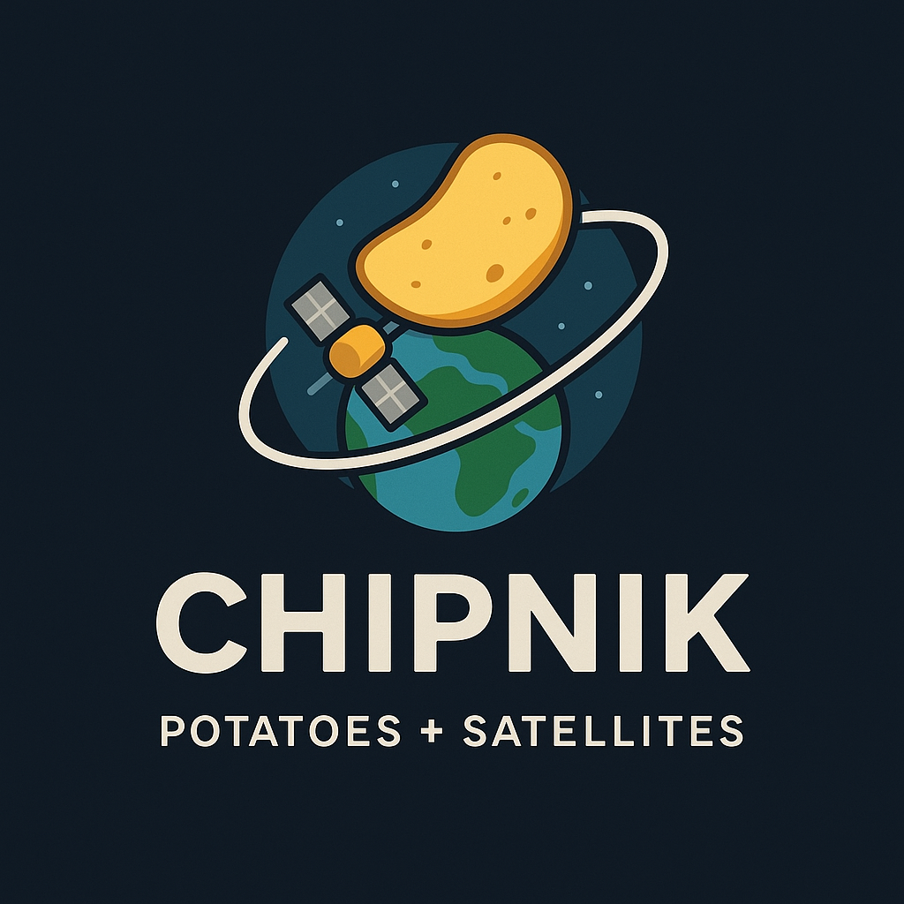

# Bloom Monitor




A Streamlit app for exploring NASA HLS imagery, computing NDVI statistics, and monitoring algal bloom activity around configurable areas of interest (AOIs).

## Prerequisites
- Python 3.10 or newer
- pip for installing dependencies

## Installation
1. (Optional) Create and activate a virtual environment:
   ```bash
   python -m venv .venv
   .venv\Scripts\activate      # Windows PowerShell
   # source .venv/bin/activate  # macOS / Linux
   ```
2. Install required packages:
   ```bash
   pip install -r requirements.txt
   ```

## NASA Earthdata Token
The app uses authenticated requests to access protected HLS Cloud Optimized GeoTIFF assets. Obtain and configure a token as follows:
1. Sign in at <https://urs.earthdata.nasa.gov/> (create an account if needed).
2. On your profile page, generate a new Application Authorization token.
3. Copy the full bearer token string.
4. Create a .env file in the project root (if it does not already exist) and add:
   `env
   EARTHDATA_BEARER_TOKEN="<your-token-here>"
   `
   The app reads this token on startup and configures GDAL/rasterio for authenticated downloads.

## Running the App
Launch the Streamlit interface with:
`bash
streamlit run bloom_monitor.py --logger.level=debug
`
The command starts a local server (default <http://localhost:8501>) with verbose logging to trace STAC queries and NDVI processing.

