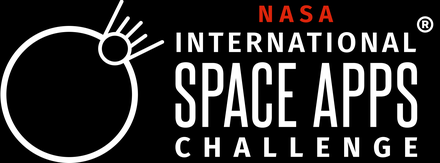
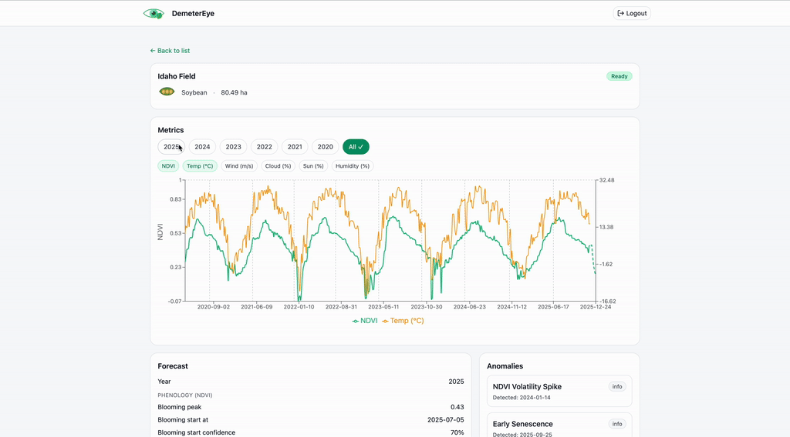

# DemeterEye

 

🌍 **Live App:** [https://demetereye-web-1060536779509.us-central1.run.app/](https://demetereye-web-1060536779509.us-central1.run.app/)

> 🚀 Developed as part of [**NASA's International Space Apps Challenge 2025**](https://www.spaceappschallenge.org/2025/) – a global hackathon empowering teams to solve real-world problems using NASA's open data and satellite imagery.

DemeterEye is an end-to-end field intelligence platform that combines NASA Harmonized Landsat Sentinel (HLS) imagery, agronomic models, and farmer-supplied data to surface vegetation trends, anomalies, and yield projections. This repository brings together the cloud-native API, the geospatial processing service, the map-driven web dashboard, and the iOS mobile application that make up the DemeterEye experience.

## Web UI Demo




## iOS UI Demo


## Highlights

- Full-stack reference implementation for remote sensing-driven crop monitoring
- Chipnik Monitor service ingests HLS tiles, detects anomalies, and publishes daily/forecast time series
- Go REST API provides authenticated access to fields, reports, and operations backed by MongoDB
- React + Leaflet web app for drawing fields, reviewing NDVI/EVI histories, and requesting new analyses
- Native iOS app for mobile field monitoring with seasonal summaries and anomaly notifications
- Dockerfiles and GitHub Actions for deploying each component to Google Cloud Run

## Repository Layout

- `api/` - Go 1.24 service that fronts MongoDB, wraps JWT auth, and brokers report generation requests
- `chipnik_monitor/` - Python 3.10+ analytics stack with FastAPI endpoints, Streamlit dashboard, and Prophet forecasting
- `web/` - React client with Leaflet tooling for field management and report visualisation
- `ios/` - Native iOS application for mobile field monitoring with seasonal tracking and notifications
- `media/` - Shared branding assets referenced by documentation and the web client
- `.github/workflows/` - CI/CD pipelines for deploying the API, web client, and on-premise monitor images

## Prerequisites

- Python 3.10 or newer with GDAL/rasterio system libraries
- Go 1.24 toolchain
- Node.js 20+ and npm 10+
- MongoDB instance (local or cloud)
- NASA Earthdata credentials with access to HLS collections
- Google Cloud SDK (optional, for Cloud Run deployments)
- Xcode 26 (for iOS development)

## Quick Start (Local Development)

1. **Set up shared infrastructure**
   - Start a MongoDB instance and note the connection string.
   - Obtain an Earthdata bearer token and keep it handy for the monitor service.
2. **Run the Chipnik Monitor processor**
   ```bash
   cd chipnik_monitor
   python -m venv .venv
   # Windows: .venv\Scripts\Activate
   # macOS/Linux: source .venv/bin/activate
   pip install -r requirements.txt
   cp .env_example .env  # fill EARTHDATA_BEARER_TOKEN, MONGO_URI, MONGO_DB, DAYS_BACK_LIMIT
   uvicorn api:app --reload --host 0.0.0.0 --port 8000
   ```
   The FastAPI docs become available at `http://127.0.0.1:8000/docs`. Optional: launch the Streamlit UI with `streamlit run chipnik_monitor.py` in a separate terminal for manual explorations.
3. **Start the DemeterEye API**
   ```bash
   cd api
   export MONGO_URI="mongodb://127.0.0.1:27017"
   export MONGO_DB="demetereye"
   export PROCESSOR_URL="http://127.0.0.1:8000"
   export JWT_SECRET="change_me"
   go run ./...
   ```
   The API exposes Swagger docs at `http://127.0.0.1:8080/swagger/index.html`.
4. **Launch the web client**
   ```bash
   cd web
   npm install
   VITE_API_BASE="http://127.0.0.1:8080" npm run dev
   ```
   Visit `http://127.0.0.1:5173` to draw fields, request reports, and visualise Chipnik outputs.
5. **Build the iOS app** (optional)
   ```bash
   cd ios
   open DemeterEye.xcodeproj
   ```
   Configure the API endpoint in the app settings and build to a simulator or device through Xcode.

## Environment Variables

### Chipnik Monitor (`chipnik_monitor/.env`)

| Key                      | Purpose                                                                 |
| ------------------------ | ----------------------------------------------------------------------- |
| `EARTHDATA_BEARER_TOKEN` | Token used to fetch HLS imagery from NASA services                      |
| `MONGO_URI`              | MongoDB connection string (shared with the API)                         |
| `MONGO_DB`               | Database name for reports and job metadata                              |
| `DAYS_BACK_LIMIT`        | Optional lookback window for historical imagery (defaults to 2000 days) |

### DemeterEye API

| Key             | Purpose                                            |
| --------------- | -------------------------------------------------- |
| `MONGO_URI`     | MongoDB connection string                          |
| `MONGO_DB`      | Database name (must match the monitor service)     |
| `PROCESSOR_URL` | Base URL of the Chipnik Monitor FastAPI service    |
| `JWT_SECRET`    | Symmetric secret for signing/verifying user tokens |
| `PORT`          | HTTP port (defaults to 8080)                       |

### Web Client

| Key             | Purpose                                                        |
| --------------- | -------------------------------------------------------------- |
| `VITE_API_BASE` | Base URL for the DemeterEye API (e.g. `http://127.0.0.1:8080`) |

## Deployment & Automation

- `deploy-chipnik-monitor.yml` and `deploy-chipnik-monitor-self-hosted.yml` publish the monitor service to Cloud Run or self-hosted runners.
- `deploy-chipnik-monitor.yml` uses the on-premise Dockerfile in `chipnik_monitor/on-premise/` for GPU-friendly builds.
- API and web subdirectories include reference `gcloud run deploy` commands in their READMEs and Dockerfiles for container builds.
- `build.ps1` and `build.sh` under `chipnik_monitor/on-premise/` package air-gapped artifacts for environments without Cloud Run.

## Additional Resources

- Processor docs: `chipnik_monitor/README.md`
- API reference & OpenAPI spec: `api/openapi.yaml`
- Front-end notes and deployment snippet: `web/README.md`
- iOS app documentation: `ios/README.md`

## iOS App Features

The mobile application helps farmers monitor field health using NASA Earth observation data:
- Login and management of multiple fields
- Map view with field boundaries
- Track field greenness and seasonal growth history
- Seasonal summaries with start, and peak of season dates
- Summaries and predictions for crop flowering

Contributions and feedback are welcome. Please open an issue or discussion if you plan to add new data sources, crop profiles, or deployment targets.

### 🏷️ Tags

**NASA • Space Apps Challenge • AgriTech • Remote Sensing • Climate Intelligence • AI for Agriculture • Geospatial • Sustainability**
